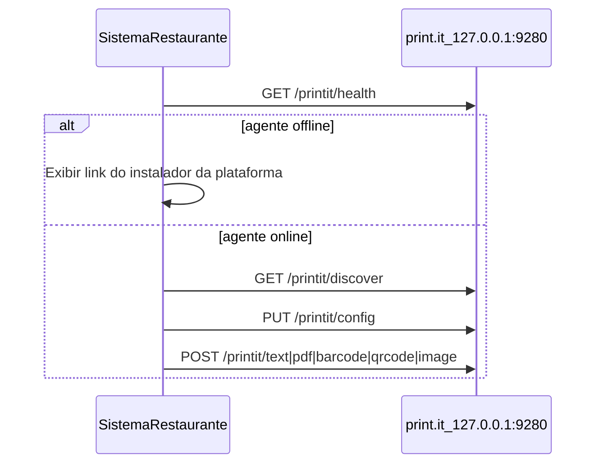

# print.it

Agente local **headless** de impressão térmica ESC/POS para PDV (Bematech MP-4200 TH ADV e similares via rede, porta 9100).

O usuário instala uma vez; o agente sobe sozinho no login. Seu sistema de restaurantes configura impressora e dispara impressões via HTTP em `http://127.0.0.1:9280/printit/` — sem `window.print()` e sem wizard na instalação.

A interface web em [`web/`](web/) existe só para debug manual.

## Instalação para o usuário final (leigo)

1. Baixe o instalador da plataforma (GitHub Releases):
   - **macOS:** `print.it-{version}-macos-{arch}.pkg` — duplo clique, aceitar, fim.
   - **Windows:** `print.it-{version}-windows-amd64.exe` — next, next, fim.
   - **Linux:** `print.it-{version}-linux-amd64.deb` — `sudo dpkg -i print.it-*.deb`
2. Faça login (ou reinicie, no macOS).
3. **Configure a impressora no sistema de gestão** — o instalador não pergunta IP, papel ou impressora.

Desinstalar:

```bash
print.it --uninstall
```

## Integração para sistema de restaurantes (PDV)

Fluxo recomendado no seu backend ou frontend admin:



### 1. Verificar se o agente está rodando

```javascript
const PRINTIT = "http://127.0.0.1:9280/printit";

async function ensurePrintIt() {
  try {
    const res = await fetch(`${PRINTIT}/health`, { signal: AbortSignal.timeout(2000) });
    if (!res.ok) throw new Error("offline");
    return await res.json(); // { ok: true, version: "0.3.0", service: "print.it" }
  } catch {
    // Mostrar link de download do instalador (macOS / Windows / Linux)
    throw new Error("Instale o print.it neste computador.");
  }
}
```

`GET /printit/health` não expõe secrets (`barcodes_api_key`). Use `/printit/status` só para debug/admin.

### 2. Configurar impressora remotamente

```javascript
// Descobrir impressoras na rede
const discovered = await fetch(`${PRINTIT}/discover`).then(r => r.json());

// Salvar config (IP, largura do papel, etc.)
await fetch(`${PRINTIT}/config`, {
  method: "PUT",
  headers: { "Content-Type": "application/json" },
  body: JSON.stringify({
    printer_host: "192.168.1.201",
    printer_port: 9100,
    paper_width_mm: 80,
    printable_width_mm: 72,
  }),
});
```

### 3. Imprimir silenciosamente

```javascript
await fetch(`${PRINTIT}/text`, {
  method: "POST",
  headers: { "Content-Type": "application/json" },
  body: JSON.stringify({
    text: "Pedido #42\nPizza Calabresa\n",
    cut: true,
    align: "left",
  }),
});
```

PDF (multipart):

```javascript
const form = new FormData();
form.append("file", pdfFile);
form.append("cut", "true");
await fetch(`${PRINTIT}/pdf`, { method: "POST", body: form });
```

> **HTTPS:** se o PDV usa `https://`, o navegador pode bloquear chamadas para `http://127.0.0.1`. Prefira proxy pelo backend na mesma máquina ou HTTP na rede local.

> **Segurança:** mantenha `listen_host: 127.0.0.1` — não exponha o agente na LAN.

## Desenvolvimento local

### Pré-requisitos

- Go 1.24+
- Impressora térmica ESC/POS na rede (IP fixo)

```bash
brew install go   # macOS
chmod +x scripts/*.sh
./scripts/build.sh
./print.it
```

Flags:

```bash
./print.it --version
./print.it --uninstall   # chama script da plataforma, se instalado
```

### Paths de config e logs

| SO | Config | Logs |
|----|--------|------|
| macOS | `~/Library/Application Support/print.it/config.json` | `~/Library/Application Support/print.it/logs/print.it.log` |
| Linux | `~/.config/print.it/config.json` | `~/.config/print.it/logs/print.it.log` |
| Windows | `%AppData%\print.it\config.json` | `%AppData%\print.it\logs\print.it.log` |

Override dev: `PRINT_IT_CONFIG=/caminho/config.json` ou `config.json` na pasta do projeto.

Auto-start após instalação:

| SO | Mecanismo |
|----|-----------|
| macOS | LaunchAgent `com.printit.agent` |
| Windows | Task Scheduler no login |
| Linux | systemd user unit `print.it.service` |

### Build de release (binários + instaladores)

```bash
./scripts/build-all.sh
```

Gera em `dist/`:

- `print.it-darwin-arm64`, `print.it-darwin-amd64`
- `print.it-linux-amd64`
- `print.it-windows-amd64.exe`
- `print.it-{version}-macos-{arch}.pkg` (no macOS)
- `print.it-{version}-linux-amd64.deb` (no Linux, com `dpkg-deb`)
- `print.it-{version}-windows-amd64.exe` (com Inno Setup / `iscc`)

CI: tag `v*` dispara [`.github/workflows/release.yml`](.github/workflows/release.yml).

## Interface web (debug)

```
http://127.0.0.1:9280/printit/
```

## API

| Método | Rota | Descrição |
|--------|------|-----------|
| GET | `/printit/health` | Health check leve (`ok`, `version`) — use no PDV |
| GET | `/printit/status` | Status completo (config sem secrets) |
| GET | `/printit/discover` | Busca impressoras na rede |
| PUT | `/printit/config` | Atualizar configuração |
| POST | `/printit/text` | Imprimir texto |
| POST | `/printit/pdf` | Imprimir PDF |
| POST | `/printit/image` | Imprimir imagem |
| POST | `/printit/barcode` | Código de barras |
| POST | `/printit/qrcode` | QR Code |
| POST | `/printit/test` | Página de teste |
| POST | `/printit/raw` | Bytes ESC/POS crus |
| GET | `/printit/` | Interface web de debug |

## Configuração (`config.json`)

| Campo | Padrão | Descrição |
|-------|--------|-----------|
| `printer_host` | `192.168.1.201` | IP da impressora |
| `printer_port` | `9100` | Porta raw |
| `listen_host` | `127.0.0.1` | Só conexões locais |
| `listen_port` | `9280` | Porta do agente |
| `paper_width_mm` | `80` | Largura do papel (58 ou 80) |
| `printable_width_mm` | `72` em papel 80mm | Área imprimível |
| `trim_trailing_blank` | `false` | Recortar branco no fim |
| `barcodes_api_key` | — | Chave server-side (não exposta no `/health`) |
| `cors_origins` | `["*"]` | CORS |

## Solução de problemas

| Problema | O que verificar |
|----------|-----------------|
| PDV não encontra agente | `curl http://127.0.0.1:9280/printit/health` — reinstalar ou relogar |
| `connection refused` na impressora | IP correto? Mesma rede? |
| Segunda instância | Agente usa lock na porta 9289; só uma instância por máquina |
| Logs | Ver pasta `logs/print.it.log` em Application Support / `.config` / AppData |

## Licença

MIT
